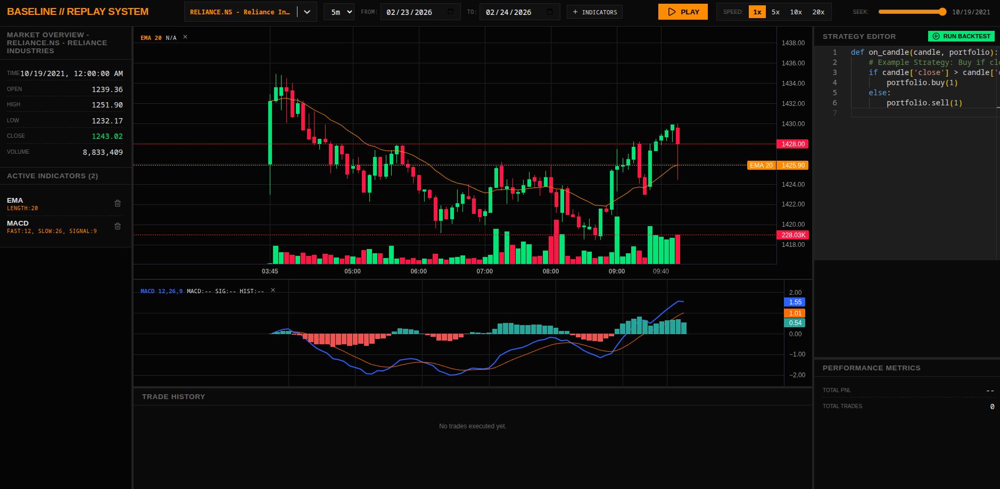

# Baseline

<div align="center">
  
</div>

A locally hosted backtesting engine and dynamic replay system for quantitative traders.

**What it does:**
- ** Real Data**: Gets real stock market data automatically.
- **Easy Strategy Testing**: Write your trading rules in simple Python and see them work instantly.
- **Replay Mode**: Play back the market candle-by-candle at your own speed to see how your strategy would have performed.
- **Customizable Layout**: Drag and resize the panels to make the screen look exactly how you want.
- **Built-in Indicators**: Includes all the classic indicators (RSI, MACD, Bollinger Bands) right out of the box.

## Quick Start

1. Install Dependencies:
```bash
./setup.sh
```

3. Run:
```bash
./run.sh
```
Access the terminal at `http://localhost:5173`.
